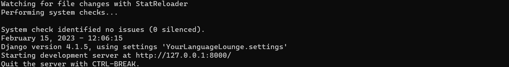
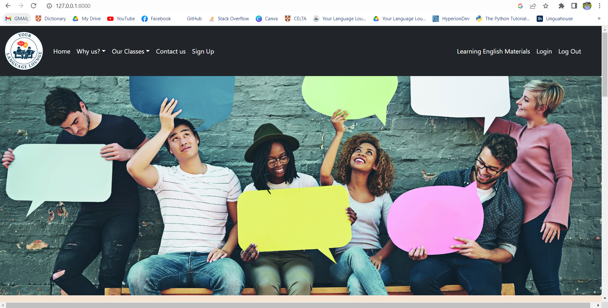
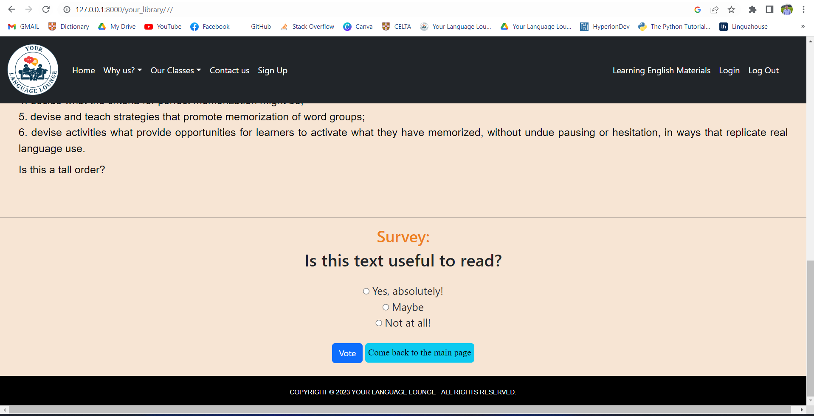
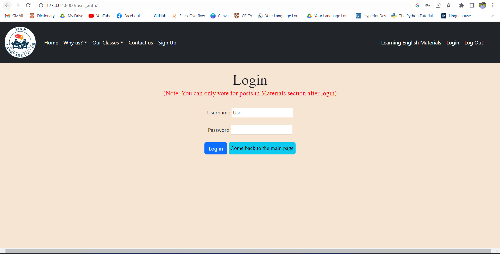
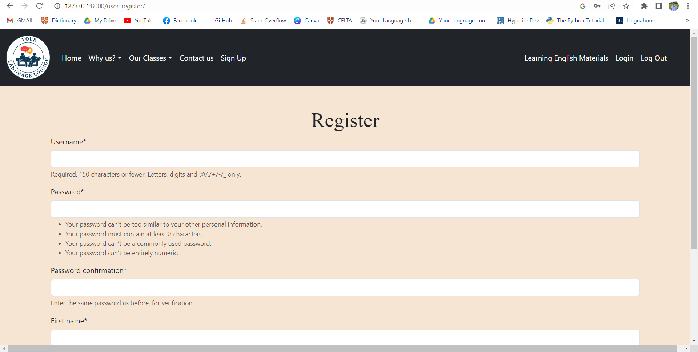
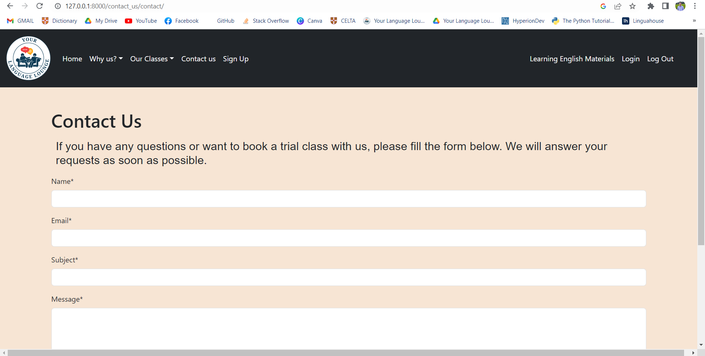

# Your Language Lounge

This is my first website built using the Django framework. The website can be used as a promotion page for a language center with much information about their values, teachers, courses, etc. Also, there is a section containing English Learning materials and related posts. A small survey is included at the end of each material and this will enable users to know other users' opinions about the post.

All the buttons and layouts are designed nicely and aim to facilitate the user's intuitive behaviour. Also, logging in is required before answering the question in the survey. Those are some of noticeable features of this website.

## Installation <a name="installation"/>

There are two common ways to install and run this website, i.e., Using Virtual Environment or Using a Docker image.

### 1. Using Virtual Environment in your computer

- If you don't have [Git](https://git-scm.com/download/win), [Python](https://www.python.org/downloads/) and [Pip](https://pypi.org/project/pip/) yet, please install those using the attached links.
After installing Python and Pip, you can confirm their version by using the command below in your Command Prompt (CP):

```bash
python --version
```
```bash
pip --version
```
- Create a virtual environment (You can name it whatever you want. 'myworld' is just an example ) by typing the command below in your CP:

```bash
py -m venv myworld
```

- Then you need to activate the created virtual enviroment by typing the command below in your CP:

```bash
myworld\Scripts\activate.bat
```
Once the environment is activated, you will see this result in the command prompt:

```bash
(myworld) C:\Users\Your Name>
```

- Move the working directory in your CP (using 'cd *directory of the folder*') to the folder that you want to have this project. For example:

```bash
(myworld) C:\Users\Your Name> cd OneDrive\Máy tính\Sites\Repo
```

- Download the project using clone function of Git to download and work with the project on your computer:

```bash
(myworld) C:\Users\Your Name\OneDrive\Máy tính\Sites\Repo> git clone https://github.com/AndrewThien/Your-Language-Lounge.git
```

- Move the working directory to the Your-Language-Lounge folder:

```bash
(myworld) C:\Users\Your Name> cd OneDrive\Máy tính\Sites\Repo> cd Your-Language-Lounge
```

- Run the code below to obtain the additional required packages to run the project.

```bash
(myworld) C:\Users\Your Name\OneDrive\Máy tính\Sites\Repo\Your-Language-Lounge> pip3 install -r requirements.txt
```

- Finally, run the code below the activate the local server:

```bash
(myworld) C:\Users\Your Name\OneDrive\Máy tính\Sites\Repo\Your-Language-Lounge> py manage.py runserver
```
- When you see the result below in your CP, go to your browser and enter this link: http://localhost:8000/ or http://127.0.0.1:8000/



- Browse along the website and its functions. Enjoy!

### 2. Using Docker image

- Download and install [Docker](https://www.docker.com/products/docker-desktop/). You may need to update your Linux as well.

- To confirm if you successfully install Docker, run this command in your CP:

```bash
docker run hello-world
```

- With the Docker app opened, run this code in your CP:

```bash
docker run --publish 8000:8000 andrewthien/my-django
```

- When finished, go to your browser and enter this link: http://localhost:8000/ or http://127.0.0.1:8000/
- Browse along the website and its functions. Enjoy!

## Table of Contents
### 1. [Installation](#installation)
### 2. [Usage](#usage)
### 3. [Contributing](#contributing)
### 4. [Credits](#credits)


## Usage <a name="usage"/>

### The webpage has many pages showing the information about Your Language Lounge. Click the button on navigation bar to access the content.



### To be able to vote in the survey after reading posts, users have to sign in.





### Users can sign up by filling the form correctly according to username/password requirements.



### Users can also contact the staff by using contact form



## Contributing <a name="contributing"/>

Pull requests are welcome. For major changes, please open an issue first to discuss what you would like to change.

## Credits <a name="credits"/>

[Tri Thien Nguyen](https://www.linkedin.com/in/tri-thien-nguyen/)
